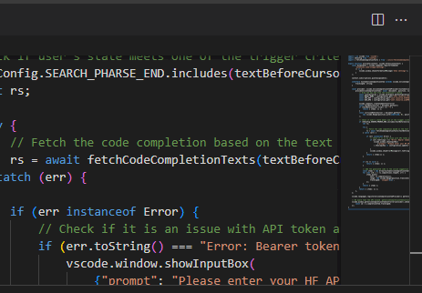
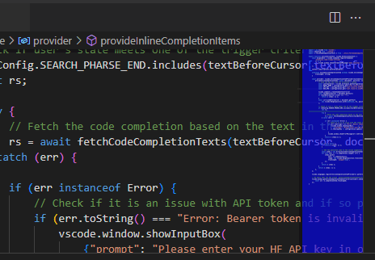

# Transparent Minimap

This extension makes your VS Code minimap transparent. You can adjust the level of transparency using the extension settings and even make your minimap a different color if you wish.

## Features ✨

- Turns your minimap transparent out-of-the-box
- Gives you more horizontal space when coding, as the code displays behind the minimap (*excellent for vertical monitors or smaller screens*)
- Adjust minimap transparency or minimap color
- Runs on Visual Studio Code for the Web (vscode.dev)
- Walkthrough to help you get started using the extension
- Keyboard shortcut to refresh minimap settings <kbd>Alt</kbd>+<kbd>M</kbd>
- Control minimap shadow border transparency as well
- Lots of extension settings for your own customizations

## How To Use 👇

* I have coded a walkthrough for this extension. It will display when you first install the extension, and will walk you through a quick initial setup to get your minimap as you like it. (access it anytime by running `Get Started: Open Walkthrough` from the Command Palette)*

## Extension Settings ⚙️

### `TransparentMinimap.transparencyLevel`

Transparency level / opacity of the minimap.
`00` is full transparent, `88` would be half-transparent and colored, `FF` would be no transparency and full color.
Remember to run the `Refresh Minimap Transparency Settings` command to apply the changes

### `TransparentMinimap.minimapColor`

Color of the minimap.
For example, `000000` is no color, `FF0000` would be fully red, `111111` would be dark grey

**NOTE** *In order for you to theme your minimap with a custom color, the transparency level cannot be `00`. Try setting your transparency level to about `88` and play around with the values to achieve your desired color.*

### `TransparentMinimap.enableTransparentMinimap`

Enable the extension to change the minimap to be transparent.

## Future To-dos and Development Ideas 📝

- Analyze code performance to find potential refactoring or optimization opportunities
- Introduce localization and/or translation to add extension in more languages
- Add a user setting to color minimap shadow border or remove it entirely
- Improve project animations and add screenshots
- Write more tests

> ➕ Have a suggestion for a feature you'd like me to improve? [Submit a feature request on the Repo's Issues page](https://github.com/BenRogersWPG/VSCode-Transparent-Minimap/issues)!

## Completed To-dos ✔️

- ~~Add some descriptions that *you need to select a somewhat opaque transparency in order to colorize (theme) your minimap*~~
- ~~Allow user to quickly turn on/off minimap transparency using extension setting checkbox~~
- ~~Consider removing extension walkthrough, as it works out-of-the-box~~
- ~~Add button on "minimap settings reverted" information message~~
- ~~Consider adding a command to prevent need to restart VS Code~~
- ~~Warn user if minimap is disabled when first installing extension~~
- ~~Add keyboard shortcut to refresh minimap setting changes~~
- ~~Test oldest supported version of VS Code for compatibility~~
- ~~Switch keybinding in documentation to use uppercase <kbd>M</kbd>~~
- ~~Create and add social preview image to GitHub project~~
- ~~Make minimap shadow border also transparent~~
- ~~Create discussion board for project on GitHub~~
- ~~Convert images and GIFs to smaller size~~
- ~~Add GIFs to demo the extension usage~~
- ~~Test on different operating systems~~
- ~~Make a better extension icon~~
- ~~Test having minimap on left~~

## Requirements 📦

- Visual Studio Code / Visual Studio Code for the Web running on any operating system

## Known Issues 🐛

- Minimap needs to be set to display on the right (*VS Code default*)

## Sponsor This Project ❤️

I spend a lot of time maintaining and enhancing this extension. If you'd like to help me out with this project, please visit [my GitHub Sponsor page](https://github.com/sponsors/BenRogersWPG/) to learn more.

*One of the reward levels of being a sponsor is that your name will even show up on this very README page!*

## Release Notes 🆕

See [CHANGELOG](https://github.com/BenRogersWPG/VSCode-Transparent-Minimap/blob/master/CHANGELOG.md) file.